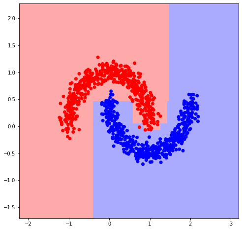

# Simple Boosting

Very simple and short implementation of gradient boosting in just 19 lines of code!

- `Friedman JH. Stochastic gradient boosting. Computational statistics & data analysis. 2002 Feb 28;38(4):367-78.`
- Note that there is no stochastic mini-batching in this implementation, but it is very easy to add!
